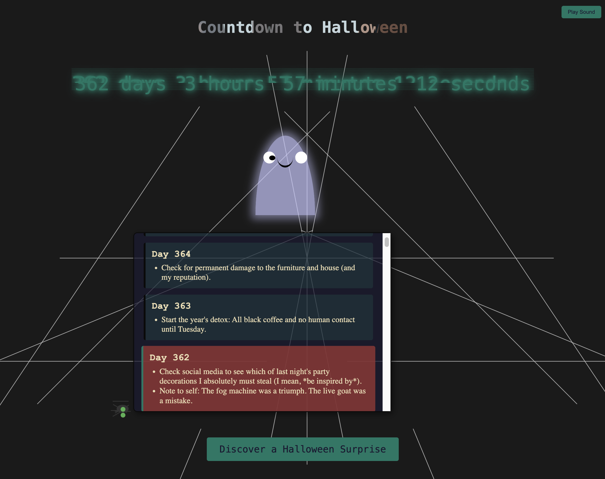

# Submission Form

_This is a submission for [Frontend Challenge - Halloween Edition, Perfect Landing](https://dev.to/challenges/frontend-2025-10-15)_

## What I Built

I built a Halloween-themed landing page that captures the spooky and fun spirit of the season. The page features a real-time countdown to the next Halloween, creating a sense of anticipation. The theme is a mix of modern tech and classic Halloween, inspired by "Wednesday Addams meets The Matrix."

The main features include:

*   A real-time countdown to Halloween with a "Matrix"-style glitch effect.
*   An interactive to-do list that highlights the current day's tasks, helping you prepare for the big night.
*   Animated elements like a floating ghost, a blinking pumpkin, and a growing spiderweb to bring the page to life.
*   A "Trick or Treat" page that reveals a surprise cocktail animation and a random spooky image.
*   A dark, modern color palette with accents of green and gold to create a spooky yet elegant atmosphere.
*   Ambient background music to enhance the spooky vibe, with a toggle to turn it on or off.

## Demo

Check out the [Live Demo](https://ulrikedetective.github.io/UlrikeHerold/Halloween/index.html)!

## Journey

My journey in building this project was a fun exploration of CSS and JavaScript to create an immersive Halloween experience.

I started by setting up the basic HTML structure and implementing the core feature: the countdown to Halloween. I then added the animated ghost and pumpkin to give the page some personality.

One of the key features I wanted to include was the to-do list. I implemented a feature to fetch the to-do list from a text file and dynamically display it on the page, with the current day's tasks highlighted.

To enhance the theme, I integrated several CSS art snippets, including a more detailed ghost and pumpkin, a growing spiderweb, and a cocktail animation for the "Trick or Treat" page. This was a great way to add more complex and interesting visuals to the project.

As the project grew, I focused on refining the UI and UX. I updated the color palette to a darker, more modern theme, improved the layout and spacing for a cleaner look, and refactored the code for better maintainability. I also improved the scrolling behavior of the to-do list to make it more user-friendly.

